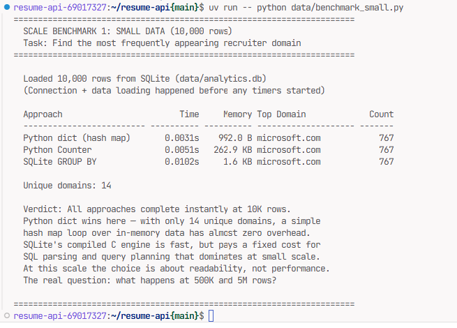
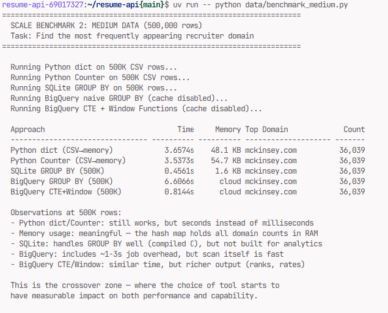
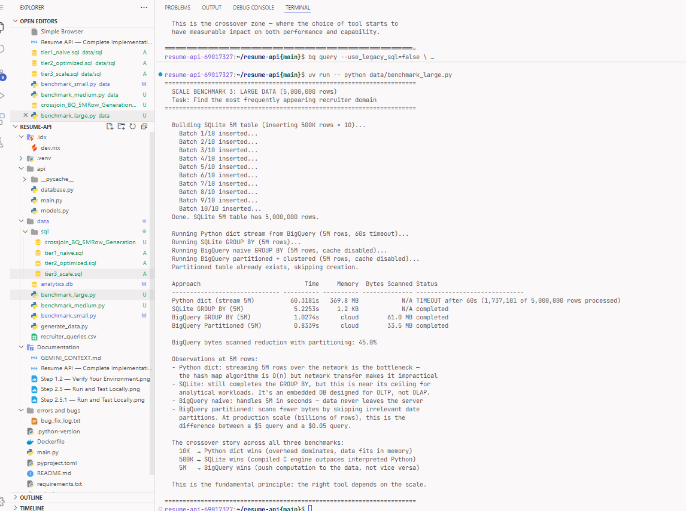
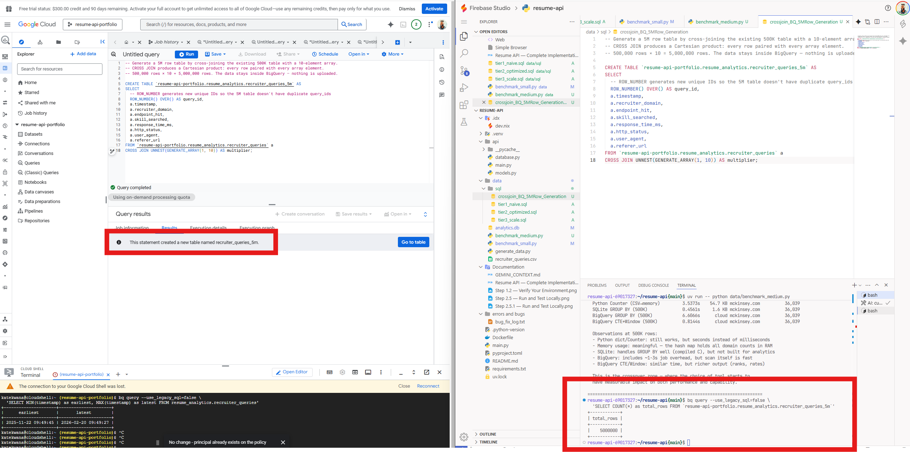
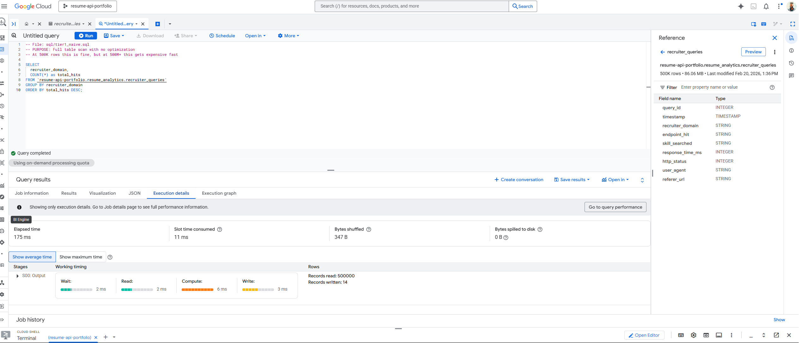
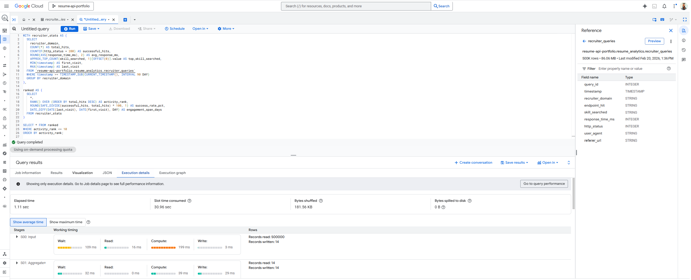
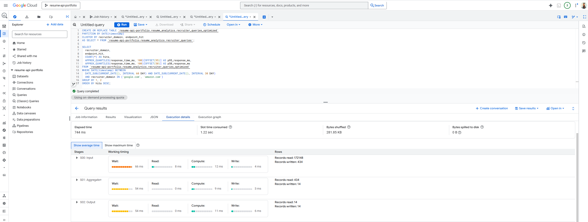

# Resume API — Technical Portfolio Project

> A REST API serving structured resume data with analytics tracking, deployed on Google Cloud Run with a dual-database architecture (SQLite for operational data, BigQuery for analytical queries at scale). A self-study project exploring API design, Linux-based deployment, Python, SQL optimization, and big data at scale — with a data model inspired by digital advertising reporting patterns.

**Live Demo:** `https://resume-api-711025857117.us-central1.run.app`
**Author:** Job Seeker
**Built With:** Firebase Studio + Gemini AI-assisted development
**Cost:** $0.00 (Google Cloud free tier)

---

## Table of Contents

- [Purpose](#purpose)
- [Key Findings: When Tool Choice Matters](#key-findings-when-tool-choice-matters)
- [SQL Query Progression](#sql-query-progression)
- [Architecture](#architecture)
- [API Design Decisions](#api-design-decisions)
- [Endpoints](#endpoints)
- [Data Model](#data-model)
- [SQLite vs BigQuery: When to Use Each](#sqlite-vs-bigquery-when-to-use-each)
- [Beyond BigQuery: Scale Discussion](#beyond-bigquery-scale-discussion)
- [Digital Marketing Ecosystem Connection](#digital-marketing-ecosystem-connection)
- [Linux Commands Used](#linux-commands-used)
- [Running Locally](#running-locally)
- [Deployment](#deployment)
- [Technologies Used](#technologies-used)

---

## Purpose

This project demonstrates four things a technical solutions consultant does daily:

- **API design** — 9 REST endpoints following resource-oriented patterns, modeled after how Google Ads API structures its resources (`/campaigns`, `/adGroups`, `/keywords`)
- **SQL optimization at scale** — a three-tier query progression (naive → CTEs + window functions → partitioned + clustered) showing how the same question gets answered differently as data grows from 500K to 5M rows
- **Data engineering judgment** — benchmarking the same task (domain frequency counting) across Python dicts, SQLite, and BigQuery at 10K / 500K / 5M rows to find where each tool breaks down and where the next one takes over
- **Cloud deployment** — Dockerized FastAPI app on Cloud Run with a dual-database architecture (SQLite for serving, BigQuery for analytics) that mirrors the operational + analytical split in enterprise ad tech

---

## Key Findings: When Tool Choice Matters

> Same task — "find the most frequently appearing domain" — run with different tools at different data volumes. The results make the crossover points concrete and measurable.

### 10K Rows — Python Wins

At small scale, all approaches complete instantly. Tool choice is about readability, not performance. A Python `dict` loop finishes in 3ms. No infrastructure needed.



### 500K Rows — The Crossover Zone

This is where tool choice starts to matter. Python dict/Counter now takes 3-4 seconds. SQLite's compiled C engine handles GROUP BY in 0.46s. BigQuery's per-query overhead (1-3s job startup) is visible, but its analytical power increases — the CTE+Window query returns richer results (ranks, success rates) in similar time.



### 5M Rows — BigQuery Wins, Python Times Out

Python dict streaming **times out at 60 seconds** after processing only 1.7M of 5M rows. SQLite still completes (5.2s) but is near its ceiling. BigQuery handles it in ~1 second. Partitioning reduces bytes scanned by 45%.



The 5M row table was generated inside BigQuery using a `CROSS JOIN` — no ETL pipeline, no file uploads:



### The Decision Framework

```
Data Volume    Best Tool                  Why
──────────     ─────────                  ───
< 100K         Python dict/Counter        Simple, no infrastructure needed
100K – 1M      SQLite or BigQuery         SQLite for embedded apps, BigQuery for analytics
1M+            BigQuery (partitioned)     Push computation to the data, not data to computation
```

**The fundamental principle:** At small scale, bring data to your code (Python). At large scale, bring your code to the data (BigQuery SQL). The benchmarks make this crossover point concrete and measurable.

---

## SQL Query Progression

> How query optimization changes as data volume grows — the core skill needed when advising clients on BigQuery best practices.

### Tier 1: Naive Query (Full Table Scan)

```sql
SELECT recruiter_domain, COUNT(*) as total_hits
FROM `resume_analytics.recruiter_queries`
GROUP BY recruiter_domain
ORDER BY total_hits DESC;
```

**Performance on 500K rows:**



**Why this is problematic at scale:** Scans every row and every column. At 50M rows, this query processes ~2GB+ and costs ~$0.01/query. At Google Ads scale (billions of rows), this pattern would cost hundreds per query run and take minutes.

---

### Tier 2: Optimized (CTEs + Window Functions)

```sql
WITH recruiter_stats AS (
  SELECT
    recruiter_domain,
    COUNT(*) AS total_hits,
    COUNTIF(http_status = 200) AS successful_hits,
    ROUND(AVG(response_time_ms), 2) AS avg_response_ms,
    APPROX_TOP_COUNT(skill_searched, 1)[OFFSET(0)].value AS top_skill,
    MIN(timestamp) AS first_visit,
    MAX(timestamp) AS last_visit
  FROM `resume_analytics.recruiter_queries`
  WHERE timestamp >= TIMESTAMP_SUB(CURRENT_TIMESTAMP(), INTERVAL 90 DAY)
  GROUP BY recruiter_domain
),
ranked AS (
  SELECT *,
    RANK() OVER (ORDER BY total_hits DESC) AS activity_rank,
    ROUND(SAFE_DIVIDE(successful_hits, total_hits) * 100, 1) AS success_rate_pct
  FROM recruiter_stats
)
SELECT * FROM ranked WHERE activity_rank <= 10 ORDER BY activity_rank;
```

**What this demonstrates:**
- `CTE`: Readable multi-step logic (production-quality pattern)
- `COUNTIF`: Conditional aggregation without CASE statements
- `APPROX_TOP_COUNT`: BigQuery-native approximate function (faster than exact at scale)
- `RANK() OVER`: Window function for ranking without self-join
- `SAFE_DIVIDE`: Prevents division-by-zero (constant in Google Ads data where impressions can be 0)
- `TIMESTAMP_SUB`: Partition-friendly date filtering

**Performance on 500K rows:**



---

### Tier 3: Partitioned & Clustered Table

```sql
-- Create optimized table structure
CREATE OR REPLACE TABLE `resume_analytics.recruiter_queries_optimized`
PARTITION BY DATE(timestamp)
CLUSTER BY recruiter_domain, endpoint_hit
AS SELECT * FROM `resume_analytics.recruiter_queries`;

-- Same query, dramatically fewer bytes scanned
SELECT recruiter_domain, endpoint_hit, COUNT(*) AS hits,
  APPROX_QUANTILES(response_time_ms, 100)[OFFSET(95)] AS p95_response_ms
FROM `resume_analytics.recruiter_queries_optimized`
WHERE DATE(timestamp) BETWEEN '2025-01-01' AND '2025-01-31'
  AND recruiter_domain IN ('google.com', 'amazon.com')
GROUP BY 1, 2
ORDER BY hits DESC;
```

**Why partitioning + clustering matters:**
- **Partition by date** → BigQuery only scans the January partition, skipping all other months
- **Cluster by domain + endpoint** → Within the partition, data is sorted for efficient filtering
- At 50M+ rows, this is the difference between a $5 query and a $0.05 query

**Performance on 500K rows:**



---

## Architecture

```
┌──────────────────────────────────────────────────────────┐
│  CLIENT (Browser / curl / Postman)                       │
└──────────────┬───────────────────────────────────────────┘
               │  HTTPS (TLS 1.3)
               ▼
┌──────────────────────────────────────────────────────────┐
│  GOOGLE CLOUD RUN                                        │
│  ┌────────────────────────────────────────────────────┐  │
│  │  FastAPI Application (Python 3.11)                 │  │
│  │  ├── /resume/*        → Resume data (in-memory)    │  │
│  │  ├── /analytics/*     → SQLite (operational)       │  │
│  │  └── Middleware: CORS, Logging, Rate Limit Headers │  │
│  └──────────┬─────────────────────────────────────────┘  │
│             │                                            │
│  ┌──────────▼──────────┐   ┌──────────────────────────┐  │
│  │  SQLite             │   │  BigQuery                │  │
│  │  (analytics.db)     │   │  (resume_analytics)      │  │
│  │  10K rows           │   │  500K+ rows              │  │
│  │  Operational queries│   │  Analytical queries      │  │
│  └─────────────────────┘   └──────────────────────────┘  │
└──────────────────────────────────────────────────────────┘
               │
               ▼
┌──────────────────────────────────────────────────────────┐
│  GITHUB REPOSITORY                                       │
│  ├── Source code + Dockerfile                            │
│  ├── SQL query files (3 tiers)                           │
│  ├── Performance screenshots                             │
│  └── This README (design decisions & trade-offs)         │
└──────────────────────────────────────────────────────────┘
```

### Why These Technology Choices

| Decision | Choice | Why | Alternative Considered |
|----------|--------|-----|----------------------|
| API Framework | FastAPI | Auto-generates OpenAPI docs (like Google APIs). Python-native. Async support. | Flask (no auto-docs), Django (overkill) |
| Operational DB | SQLite | Zero-config, embedded, perfect for <100K rows. Ships with Python. | Postgres (requires separate server for a demo) |
| Analytical DB | BigQuery | Columnar storage, handles billions of rows, native to Google Cloud. | Postgres (not designed for analytical workloads at scale) |
| Hosting | Cloud Run | Serverless, scales to zero (free when idle), Docker-native, HTTPS out of the box. | App Engine (less control), Compute Engine (always-on cost) |
| Containerization | Docker | Industry standard. Reproducible builds. Required for Cloud Run. | Direct deployment (less portable, harder to reproduce) |
| Dev Environment | Firebase Studio | Browser-based Linux IDE with Gemini AI, terminal access, and GCP integration. | Local VS Code (works, but this showcases Google ecosystem) |

### How This Mirrors Real-World Technical Consulting

A technical solutions consultant working with enterprise ad tech clients regularly architects this exact pattern:
- **Operational database** (Firestore/Cloud SQL) for real-time app data
- **Analytical database** (BigQuery) for reporting pipelines via Google Ads Data Transfer Service
- **REST APIs** for client integrations with Google Ads, GA4, and custom measurement
- **Cloud Run** for deploying client-facing solutions that auto-scale

---

## API Design Decisions

### Resource Model (Nouns, Not Verbs)

The API follows REST conventions — resources are nouns, HTTP methods are verbs:

```
/resume                 → The resume resource (complete document)
/resume/experience      → Sub-resource: work experience section
/resume/skills          → Sub-resource: skills inventory
/resume/education       → Sub-resource: education history
/resume/certifications  → Sub-resource: professional certifications
/analytics/queries      → Analytics resource: query log data
/analytics/top-domains  → Analytics resource: aggregated domain stats
/analytics/performance  → Analytics resource: response time metrics
```

**Why separate endpoints instead of one monolithic `/resume`?**

This was a deliberate design decision. A single endpoint returning everything is simpler, but:
1. **Clients rarely need everything.** Someone browsing skills doesn't need education history.
2. **Bandwidth efficiency.** Mobile clients or rate-limited integrations benefit from smaller payloads.
3. **Caching granularity.** Skills change less often than experience — separate resources allow different cache TTLs.
4. **This mirrors Google Ads API design.** The Google Ads API uses separate resource endpoints (`/campaigns`, `/adGroups`, `/keywords`) rather than one giant response — for the same reasons.

**Trade-off acknowledged:** More endpoints = more client complexity. For very small APIs, a single endpoint with `?fields=experience,skills` query parameter could work (like Google APIs' partial response). Both approaches are valid; this project demonstrates the multi-endpoint pattern.

### Query Parameters

```
GET /resume/experience?company=deloitte&after=2020
GET /resume/skills?category=databases&keyword=sql
GET /analytics/queries?domain=google.com&limit=50&offset=0
GET /analytics/top-domains?n=10
```

- **Filtering** (`company`, `category`, `keyword`, `domain`): Reduces payload to relevant data
- **Pagination** (`limit`, `offset`): Prevents unbounded response sizes on the analytics endpoints
- **Parameterized aggregation** (`n`): Client controls the top-N without over-fetching

### HTTP Status Codes

| Code | When Used | Example |
|------|-----------|---------|
| `200 OK` | Successful response | `GET /resume` returns resume data |
| `400 Bad Request` | Invalid query parameter | `?limit=-5` or `?n=abc` |
| `404 Not Found` | Resource doesn't exist | `GET /resume/hobbies` (not a valid section) |
| `500 Internal Server Error` | Unhandled server failure | Database connection drops |

### Rate Limiting Headers

Every response includes:
```
X-RateLimit-Limit: 100
X-RateLimit-Remaining: 97
X-RateLimit-Reset: 1708300800
```

These are informational in this demo (not enforced server-side), but demonstrate awareness of API gateway patterns. In production, enforcement would happen at the load balancer or API gateway layer (e.g., Google Cloud Endpoints, Apigee).

---

## Endpoints

### Resume Endpoints

| Method | Endpoint | Description | Query Params |
|--------|----------|-------------|-------------|
| `GET` | `/` | Health check + API metadata | — |
| `GET` | `/resume` | Complete resume as structured JSON | — |
| `GET` | `/resume/experience` | Work experience entries | `?company=`, `?after=` |
| `GET` | `/resume/skills` | Skills grouped by category | `?category=`, `?keyword=` |
| `GET` | `/resume/education` | Education history | — |
| `GET` | `/resume/certifications` | Professional certifications | — |

### Analytics Endpoints

| Method | Endpoint | Description | Query Params |
|--------|----------|-------------|-------------|
| `GET` | `/analytics/queries` | Raw query log from SQLite | `?domain=`, `?limit=`, `?offset=` |
| `GET` | `/analytics/top-domains` | Top N domains by hit count | `?n=` (default 10) |
| `GET` | `/analytics/performance` | Response time percentiles (p50, p95, p99) | — |

### Example Response: `GET /resume/skills?keyword=sql`

```json
{
  "technical_development": [
    "SQL (PostgreSQL, Oracle, T-SQL)"
  ]
}
```

### Example Response: `GET /analytics/top-domains?n=3`

```json
{
  "top_domains": {
    "microsoft.com": 767,
    "jpmorganchase.com": 753,
    "deloitte.com": 744
  }
}
```

---

## Data Model

### Entity Relationship (Analytics Data)

```
┌─────────────────────────────────────────────────┐
│  api_queries (SQLite: 10K rows / BQ: 500K rows) │
├─────────────────────────────────────────────────┤
│  query_id          INTEGER  PK                  │
│  timestamp         DATETIME                      │
│  recruiter_domain  TEXT      ← "advertiser"      │
│  endpoint_hit      TEXT      ← "campaign type"   │
│  skill_searched    TEXT      ← "keyword"         │
│  response_time_ms  INTEGER   ← "latency"         │
│  http_status       INTEGER   ← "delivery status" │
│  user_agent        TEXT                           │
│  referer_url       TEXT                           │
└─────────────────────────────────────────────────┘
```

### Why This Schema Mirrors Google Ads Reporting

This data model is intentionally designed to parallel Google Ads data structures:

| This Project | Google Ads Equivalent | Why the Parallel |
|-------------|----------------------|-----------------|
| `recruiter_domain` | `customer.descriptive_name` (Advertiser) | Both identify who is making requests |
| `endpoint_hit` | `campaign.advertising_channel_type` | Both categorize the type of interaction |
| `skill_searched` | `keyword.text` | Both represent what the requestor is looking for |
| `response_time_ms` | `metrics.average_page_views` / latency tracking | Both measure delivery performance |
| `http_status` | `ad_group_ad.status` (delivery status) | Both track success/failure of delivery |
| `timestamp` | `segments.date` | Both are the primary partition key |

A consultant working with retail advertisers builds BigQuery pipelines with exactly these JOIN patterns — performance metrics (facts) joined to dimensional attributes (campaign, ad group, keyword) filtered by date partitions.

---

## SQLite vs BigQuery: When to Use Each

| Dimension | SQLite | BigQuery |
|-----------|--------|----------|
| Best for | Embedded/local, <100K rows, single user | Analytical, millions-billions rows, concurrent |
| Storage model | Row-oriented | Columnar |
| Query cost model | Free (local compute) | Pay per bytes scanned |
| Latency | Sub-millisecond (local) | 1-5 seconds (network + distributed scan) |
| Concurrency | Single-writer | Thousands of concurrent queries |
| This project | 10K-row operational store | 500K-row analytical warehouse |
| Google Ads parallel | Cloud SQL (operational) | BigQuery via Data Transfer Service |

**The decision framework:** If the client needs sub-second reads for a live application → relational DB (Cloud SQL, AlloyDB). If they need to analyze millions of ad performance rows for reporting → BigQuery. Most enterprise clients need both, connected by an ETL/ELT pipeline.

---

## Beyond BigQuery: Scale Discussion

*These are architectural options discussed, not built — demonstrating awareness of when tools change.*

| Scenario | When BigQuery Isn't Enough | Recommended Alternative |
|----------|---------------------------|------------------------|
| Real-time streaming (sub-second ingestion) | BigQuery streaming has ~seconds latency | Dataflow / Apache Beam → BigQuery |
| Sub-10ms key-value reads | BigQuery is analytical, not transactional | Bigtable (NoSQL, low-latency) |
| Globally distributed transactions | BigQuery isn't ACID-transactional | Spanner (global SQL with strong consistency) |
| ML model training on massive datasets | BigQuery ML covers basics | Vertex AI with BigQuery as feature store |

**Real-world example:** A retail advertiser processing real-time bidding data at scale might use Bigtable for sub-10ms user profile lookups during the ad auction, while BigQuery serves as the downstream analytical layer for daily performance reporting. A technical consultant designs the pipeline connecting both.

---

## Digital Marketing Ecosystem Connection

This project's architecture directly maps to patterns used in enterprise ad tech consulting:

```
THIS PROJECT                         AD TECH CONSULTING WORK
─────────────                        ────────────────────────
Resume API endpoints          ≈      Google Ads API resources
Recruiter query analytics     ≈      Conversion tracking / measurement
Domain tracking               ≈      Advertiser performance monitoring
SQLite (operational)          ≈      Cloud SQL / Firestore (app layer)
BigQuery (analytical)         ≈      BigQuery via Ads Data Transfer Service
Partitioned tables            ≈      Date-partitioned ad performance tables
CTE + Window functions        ≈      Standard Ads reporting SQL patterns
Response time monitoring      ≈      API latency SLAs for client integrations
Docker + Cloud Run            ≈      Custom solution deployment for clients
FastAPI auto-docs             ≈      API documentation for partner integrations
Scale benchmarks (10K→5M)     ≈      Proving "right tool for the job" at different data volumes
CROSS JOIN data generation    ≈      SQL-native test data pipelines (no ETL overhead)
```

---

## Linux Commands Used

| Command | What It Does | When You'd Use It |
|---------|-------------|-------------------|
| `uname -a` | Show OS/kernel info | Verify server environment matches deployment target |
| `mkdir -p` | Create nested directories | Set up project structure on a new server |
| `ps aux \| grep uvicorn` | Find running processes | Debug "is the API server still running?" |
| `ss -tlnp \| grep 8000` | Check listening ports | Verify API is bound to the correct port |
| `top -bn1` | System resource usage | Diagnose "why is the server slow?" |
| `kill <PID>` | Stop a process | Graceful server shutdown during deployment |
| `curl -i` | HTTP request with headers | Test API responses and status codes |
| `docker build / run` | Container management | Package and test before cloud deployment |
| `gcloud run deploy` | Deploy to Cloud Run | Production deployment to Google infrastructure |
| `bq load` | Upload data to BigQuery | Pipeline data into analytical warehouse |
| `chmod` | Change file permissions | Secure service account key files |
| `grep / find / cat` | File search and inspection | Debug configuration files and logs |

---

## Running Locally

```bash
# Clone the repo
git clone https://github.com/BTECHK/resume-api.git
cd resume-api

# Install dependencies
pip install -r requirements.txt

# Generate sample data
python data/generate_data.py

# Start the API server
cd api && uvicorn main:app --host 0.0.0.0 --port 8000 --reload

# In another terminal — test endpoints
curl http://localhost:8000/ | python3 -m json.tool
curl http://localhost:8000/resume | python3 -m json.tool
curl "http://localhost:8000/resume/experience?company=deloitte" | python3 -m json.tool
curl "http://localhost:8000/analytics/top-domains?n=5" | python3 -m json.tool

# View auto-generated API docs
# Open browser to: http://localhost:8000/docs
```

---

## Deployment

```bash
# Build and deploy to Cloud Run
gcloud run deploy resume-api \
  --source . \
  --region us-central1 \
  --allow-unauthenticated \
  --port 8080 \
  --memory 512Mi \
  --max-instances 1
```

---

## Technologies Used

| Technology | Purpose | Version |
|-----------|---------|---------|
| Python | Primary language | 3.11 |
| FastAPI | REST API framework | Latest |
| Uvicorn | ASGI server | Latest |
| SQLite | Operational database | Built-in |
| BigQuery | Analytical data warehouse | Google Cloud |
| Docker | Containerization | Latest |
| Cloud Run | Serverless hosting | Google Cloud |
| Firebase Studio | Development environment | Google Cloud |
| Faker | Test data generation | Latest |
| Pandas | Data manipulation | Latest |
| google-cloud-bigquery | BigQuery Python client (used in scale benchmarks) | Latest |
| tracemalloc | Memory profiling (built-in, used in benchmarks) | Built-in |

---

## License

This is a portfolio project built for educational and self-study purposes.
