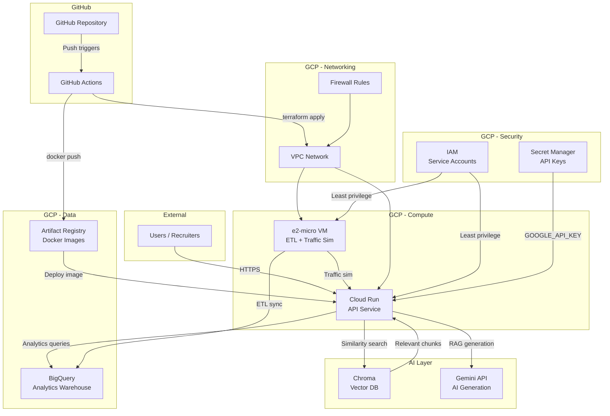
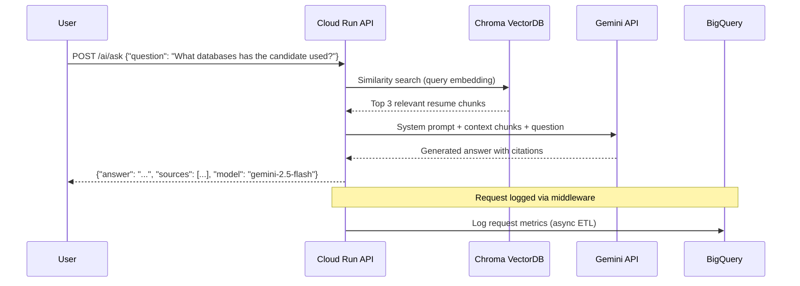
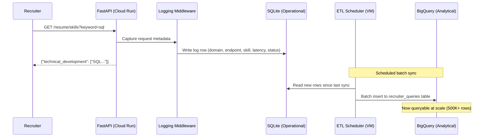
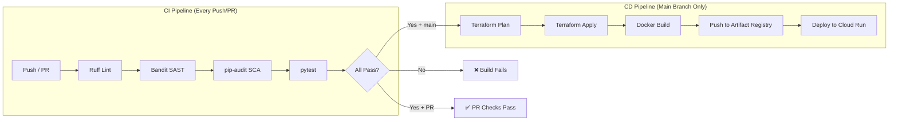
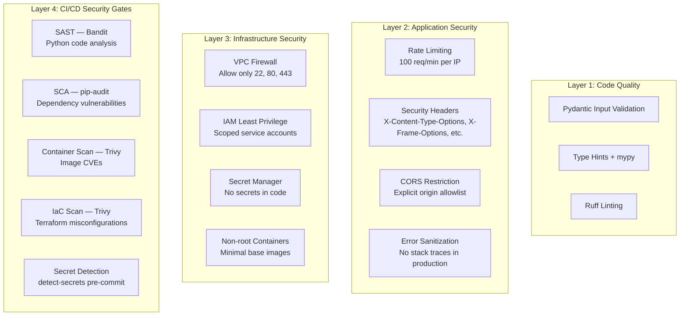

# Resume API — Architecture Diagram

## System Overview



## Data Flow: AI Resume Q&A



## Data Flow: Analytics Pipeline



## CI/CD Pipeline



## Security Layers



## Component Responsibilities

| Component | Responsibility | Technology |
|-----------|---------------|------------|
| Cloud Run | API hosting, auto-scaling, HTTPS termination | FastAPI, Docker, Uvicorn |
| e2-micro VM | ETL scheduler, traffic simulation (Locust) | Docker Compose, APScheduler |
| BigQuery | Analytics warehouse, scale queries (500K+ rows) | SQL (3-tier progression) |
| Artifact Registry | Docker image storage and versioning | Docker |
| Chroma | Vector similarity search for RAG | ChromaDB, HuggingFace embeddings |
| Gemini 2.5 Flash | AI text generation for resume Q&A | LangChain, Google AI |
| GitHub Actions | CI/CD automation (lint → scan → test → deploy) | YAML workflows |
| Terraform | Infrastructure as Code for all GCP resources | HCL modules |
| SQLite | Operational database for real-time analytics | Built-in Python |
| Secret Manager | Secure storage for API keys and credentials | GCP |

## Technology Stack Summary

```
Frontend / Client:  curl, Postman, Swagger UI (/docs)
API Framework:      FastAPI + Uvicorn (Python 3.11)
Databases:          SQLite (operational) + BigQuery (analytical) + Chroma (vector)
AI:                 Gemini 2.5 Flash + LangChain + HuggingFace all-MiniLM-L6-v2
Infrastructure:     Terraform (GCS remote state, modular HCL)
CI/CD:              GitHub Actions (CI: lint/scan/test, CD: build/deploy)
Security:           Bandit, pip-audit, Trivy, detect-secrets, OWASP alignment
Hosting:            Cloud Run (API) + e2-micro VM (ETL/traffic)
Container:          Docker + Artifact Registry
Cost:               $0.00/month (GCP Always Free + GitHub free tier)
```
